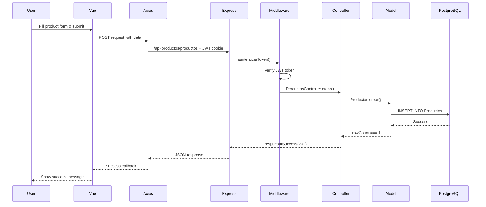

## Overview

Sistema de Productos is a full-stack web application built with a modern separation of concerns architecture. The system consists of a Vue.js frontend and an Express.js backend API, connected through RESTful endpoints.

## Technology Stack

<CardGroup cols={2}>
  <Card title="Frontend" icon="vuejs">
    - Vue.js 3 with Composition API
    - Vue Router for navigation
    - Axios for HTTP requests
    - Component-based architecture
  </Card>
  <Card title="Backend" icon="server">
    - Node.js with Express.js
    - PostgreSQL database
    - JWT authentication
    - MVC architecture pattern
  </Card>
</CardGroup>

## Architecture Diagram

```
┌─────────────────────────────────────────────────────────┐
│                   Frontend (Vue.js)                     │
│  ┌──────────┐  ┌──────────┐  ┌──────────┐             │
│  │  Views   │  │Components│  │   API    │             │
│  │          │  │          │  │  Client  │             │
│  └──────────┘  └──────────┘  └────┬─────┘             │
│                                    │                    │
└────────────────────────────────────┼────────────────────┘
                                     │ HTTP/HTTPS
                                     │ (localhost:5173)
┌────────────────────────────────────┼────────────────────┐
│                                    ▼                     │
│              Backend API (Express.js)                   │
│  ┌──────────┐  ┌──────────┐  ┌──────────┐             │
│  │  Routes  │→ │Controller│→ │  Models  │             │
│  └──────────┘  └──────────┘  └────┬─────┘             │
│       ▲                            │                    │
│       │                            ▼                    │
│  ┌────┴──────┐            ┌────────────┐               │
│  │Middlewares│            │ PostgreSQL │               │
│  └───────────┘            └────────────┘               │
└─────────────────────────────────────────────────────────┘
```

## Backend Structure

The backend follows the Model-View-Controller (MVC) pattern with additional middleware and helper layers.

### Application Entry Point

The application is initialized in two main files:

<CodeGroup>
```javascript server/index.js
import app from './app.js';
import 'dotenv/config';

const port = process.env.PORT;

app.listen(port, () => {
  console.log(`API funcionando en el puerto ${port}.`);
});
```

```javascript server/app.js
import express from 'express';
import cookieParser from 'cookie-parser';
import cors from 'cors';
import router from './routes/index.js';

const app = express();

// CORS configuration for frontend communication
app.use(cors({
  origin: 'http://localhost:5173',
  credentials: true
}));

// Middleware setup
app.use(express.json());
app.use(cookieParser());

// Mount all routes under /api-productos
app.use('/api-productos', router);

export default app;
```
</CodeGroup>

<Note>
  All API endpoints are prefixed with `/api-productos`. For example, to access products, use `/api-productos/productos`.
</Note>

### Routing Structure

The application uses a centralized routing system:

```javascript server/routes/index.js
import { Router } from "express";
import CategoriasRoutes from "./categorias.routes.js";
import ProductosRoutes from './productos.routes.js';
import UsuariosRoutes from './usuarios.routes.js';

const router = Router();

// Health check endpoint
router.get('/', (req, res) => {
  res.send('API funcionando correctamente.');
});

// Resource routes
router.use('/categorias', CategoriasRoutes);
router.use('/productos', ProductosRoutes);
router.use('/usuarios', UsuariosRoutes);

export default router;
```

### API Endpoint Structure

<Accordion title="Productos Endpoints">
  All product endpoints require authentication via JWT token.

  ```javascript
  GET    /api-productos/productos      // List all products
  POST   /api-productos/productos      // Create new product
  GET    /api-productos/productos/:id  // Get product by ID
  PUT    /api-productos/productos/:id  // Update product
  DELETE /api-productos/productos/:id  // Delete product
  ```

  Example route definition from `server/routes/productos.routes.js`:
  ```javascript
  import express from 'express';
  import ProductosController from '../controllers/productos.controller.js';
  import { auntenticarToken } from '../middlewares/auth.js';

  const ProductosRoutes = express.Router();

  ProductosRoutes.get('/', auntenticarToken, ProductosController.listar);
  ProductosRoutes.post('/', auntenticarToken, ProductosController.crear);
  ProductosRoutes.route('/:id')
    .get(auntenticarToken, ProductosController.leer)
    .put(auntenticarToken, ProductosController.actualizar)
    .delete(auntenticarToken, ProductosController.eliminar);
  ```
</Accordion>

<Accordion title="Categorias Endpoints">
  All category endpoints require authentication.

  ```javascript
  GET    /api-productos/categorias      // List all categories
  POST   /api-productos/categorias      // Create new category
  GET    /api-productos/categorias/:id  // Get category by ID
  PUT    /api-productos/categorias/:id  // Update category
  DELETE /api-productos/categorias/:id  // Delete category
  ```
</Accordion>

<Accordion title="Usuarios Endpoints">
  User management and authentication endpoints.

  ```javascript
  GET    /api-productos/usuarios           // List all users (admin only)
  POST   /api-productos/usuarios           // Create new user (admin only)
  GET    /api-productos/usuarios/:id       // Get user by ID
  PUT    /api-productos/usuarios/:id       // Update user
  DELETE /api-productos/usuarios/:id       // Delete user
  POST   /api-productos/usuarios/login     // User login
  POST   /api-productos/usuarios/logout    // User logout
  POST   /api-productos/usuarios/recuperar // Password recovery
  ```
</Accordion>

### MVC Layer Organization

<Steps>
  <Step title="Routes Layer">
    Routes define the API endpoints and apply middleware. Located in `server/routes/`.
    
    Each route file:
    - Maps HTTP methods to controller actions
    - Applies authentication middleware
    - Groups related endpoints
  </Step>

  <Step title="Controllers Layer">
    Controllers handle request/response logic. Located in `server/controllers/`.
    
    Responsibilities:
    - Request validation
    - Business logic coordination
    - Error handling
    - Response formatting
  </Step>

  <Step title="Models Layer">
    Models interact with the database. Located in `server/models/`.
    
    Example from `server/models/productos.model.js`:
    ```javascript
    import pool from '../config/database.js';

    class Productos {
      async listar() {
        const sql = 'SELECT * FROM ProductosView ORDER BY nombre;';
        const resultado = await pool.query(sql);
        return resultado.rows;
      }

      async crear(producto) {
        const sql = 'INSERT INTO Productos (nombre, precio, stock, descripcion, idCategoria, creado) VALUES ($1, $2, $3, $4, $5, CURRENT_TIMESTAMP);';
        const resultado = await pool.query(sql, producto);
        return resultado.rowCount === 1;
      }

      async leer(id) {
        const sql = 'SELECT * FROM ProductosView WHERE id = $1;';
        const resultado = await pool.query(sql, [ id ]);
        return resultado.rows[0];
      }

      async actualizar(producto) {
        const sql = 'UPDATE Productos SET nombre = $1, precio = $2, stock = $3, descripcion = $4, idCategoria = $5, actualizado = CURRENT_TIMESTAMP WHERE id = $6;';
        const resultado = await pool.query(sql, producto);
        return resultado.rowCount === 1;
      }

      async eliminar(id) {
        const sql = 'DELETE FROM Productos WHERE id = $1;';
        const resultado = await pool.query(sql, [ id ]);
        return resultado.rowCount === 1;
      }
    }

    export default new Productos();
    ```
  </Step>
</Steps>

### Database Connection

The application uses `pg` (node-postgres) for PostgreSQL connectivity:

```javascript server/config/database.js
import { Pool } from 'pg';
import 'dotenv/config';

const pool = new Pool({
  user: process.env.PG_USER || 'postgres',
  host: process.env.PG_HOST || 'localhost',
  database: process.env.PG_DATABASE || 'ejercicio_productos',
  password: process.env.PG_PASSWORD || 'tu_contraseña',
  port: process.env.PG_PORT || 5432,
});

pool.connect((error) => {
  if(error) throw error;
  console.log('Base de datos conectada.');
});

export default pool;
```

<Warning>
  The pool instance is shared across all models. Ensure proper connection pooling configuration in production environments.
</Warning>

## Frontend Structure

The frontend is built with Vue.js 3 and follows a component-based architecture.

### Application Structure

```
src/
├── App.vue              # Root component
├── main.js              # Application entry point
├── router/              # Vue Router configuration
├── api/
│   └── axios.js         # Axios instance configuration
├── views/               # Page components
│   ├── Inicio.vue       # Home/Dashboard
│   ├── Productos.vue    # Products management
│   ├── Categorias.vue   # Categories management
│   └── Usuarios.vue     # User management
└── components/          # Reusable components
    ├── Header.vue
    ├── LoginContrasena.vue
    ├── Productos/
    ├── Categorias/
    └── Usuarios/
```

### Communication Flow

<Steps>
  <Step title="User Interaction">
    User interacts with Vue components in the browser
  </Step>
  
  <Step title="API Request">
    Component calls API methods using Axios configured in `src/api/axios.js`
  </Step>
  
  <Step title="Authentication">
    Axios sends JWT token in cookies with each request
  </Step>
  
  <Step title="Backend Processing">
    Express routes → Middleware → Controllers → Models → Database
  </Step>
  
  <Step title="Response">
    Data flows back through the same chain to the Vue component
  </Step>
</Steps>

## Middleware Architecture

The application uses middleware for cross-cutting concerns:

<CardGroup cols={2}>
  <Card title="CORS" icon="globe">
    Configured in `app.js` to allow requests from the Vue.js development server (localhost:5173) with credentials.
  </Card>
  
  <Card title="Cookie Parser" icon="cookie">
    Parses cookie headers to enable JWT token storage in HTTP-only cookies.
  </Card>
  
  <Card title="JSON Parser" icon="code">
    Built-in Express middleware to parse JSON request bodies.
  </Card>
  
  <Card title="Authentication" icon="shield">
    Custom middleware for JWT verification and role-based access control. See [Authentication](/concepts/authentication) for details.
  </Card>
</CardGroup>

## Helper Modules

The backend includes several helper modules in `server/helpers/`:

- **auth.js** - JWT token generation
- **respuestas.js** - Standardized API response formatting
- **generarContraseña.js** - Random password generation for recovery
- **mailer.js** - Email sending functionality

## Environment Configuration

The application uses environment variables for configuration:

```bash .env
# Server Configuration
PORT=3000

# Database Configuration
PG_USER=postgres
PG_HOST=localhost
PG_DATABASE=ejercicio_productos
PG_PASSWORD=your_password
PG_PORT=5432

# JWT Configuration
JWT_SECRET=your_secret_key_here

# Email Configuration (for password recovery)
EMAIL_HOST=smtp.example.com
EMAIL_PORT=587
EMAIL_USER=your_email@example.com
EMAIL_PASSWORD=your_email_password
```

<Info>
  Always use strong, unique values for `JWT_SECRET` in production environments.
</Info>

## Data Flow Example

Here's how a typical product creation request flows through the system:



## Security Considerations

<Warning>
  The architecture implements several security best practices:
  
  - JWT tokens stored in HTTP-only cookies to prevent XSS attacks
  - CORS configured to allow only specific origins
  - Passwords hashed with bcrypt before storage
  - All routes (except login/logout) require authentication
  - Role-based access control for admin operations
  
  See [Authentication](/concepts/authentication) for detailed security implementation.
</Warning>

## Next Steps

<CardGroup cols={2}>
  <Card title="Authentication" icon="lock" href="/concepts/authentication">
    Learn about JWT authentication and authorization
  </Card>
  <Card title="Database Schema" icon="database" href="/concepts/database-schema">
    Explore the PostgreSQL schema and data models
  </Card>
</CardGroup>