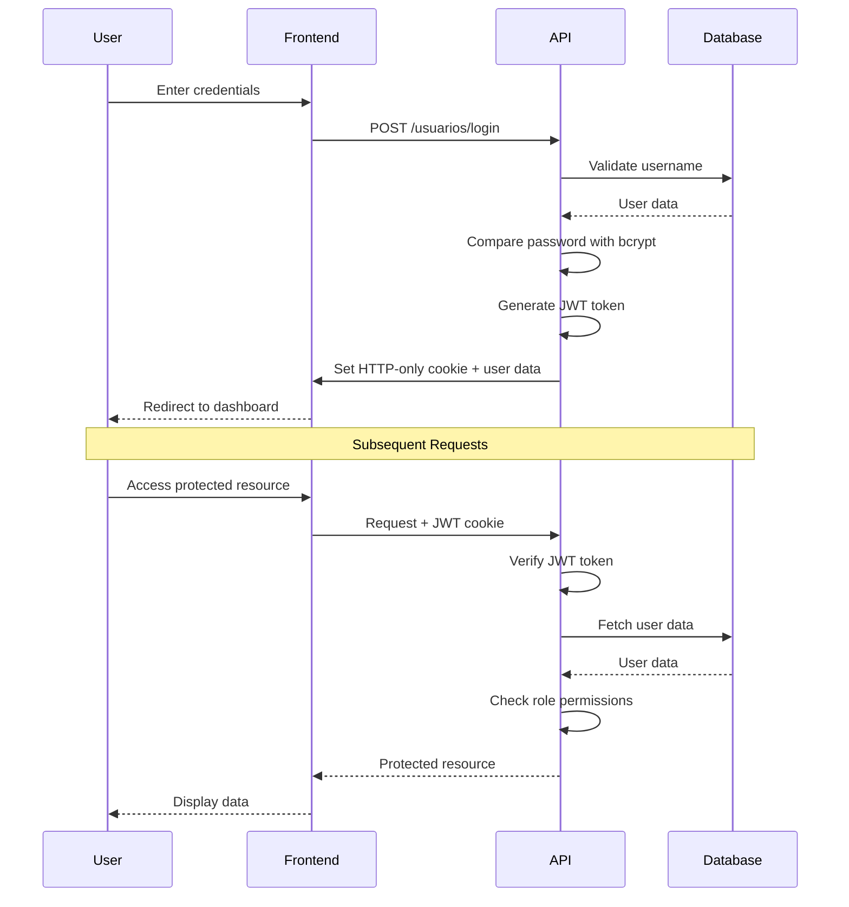

## Overview

Sistema de Productos implements a secure authentication system using JSON Web Tokens (JWT) with HTTP-only cookies. The system supports role-based access control with two user roles: **Administrator** and regular **user**.

## Authentication Flow



## JWT Token Generation

Tokens are generated using the `jsonwebtoken` library and include user identification and role information.

### Token Generation Function

From `server/helpers/auth.js`:

```javascript server/helpers/auth.js
import jwt from 'jsonwebtoken';
import 'dotenv/config';

export function generarToken(id, nombre, rol) {
  return jwt.sign(
    { id, nombre, rol },
    process.env.JWT_SECRET,
    { expiresIn: '5h' }
  );
}
```

<Info>
  Tokens are valid for 5 hours by default. After expiration, users must log in again.
</Info>

### Token Payload Structure

Each JWT token contains:

```json
{
  "id": 1,
  "nombre": "admin01",
  "rol": "Administrador",
  "iat": 1234567890,
  "exp": 1234585890
}
```

<Accordion title="Token Payload Fields">
  - **id**: User's unique identifier in the database
  - **nombre**: Username for display purposes
  - **rol**: User role ("Administrador" or user role)
  - **iat**: Issued at timestamp (automatically added by JWT)
  - **exp**: Expiration timestamp (automatically calculated from expiresIn)
</Accordion>

## Login Process

The login process validates credentials and establishes an authenticated session.

### Login Controller

From `server/controllers/usuarios.controller.js`:

```javascript server/controllers/usuarios.controller.js
import bcrypt from 'bcrypt';
import Usuarios from '../models/usuarios.model.js';
import { generarToken } from '../helpers/auth.js';
import { respuestaSuccess, respuestaError } from '../helpers/respuestas.js';

async loginUsuario(req, res) {
  try {
    const { nombre, contrasena } = req.body;
    
    // Step 1: Find user by username
    const usuario = await Usuarios.validarUsuario(nombre);
    if (!usuario) {
      return respuestaError(req, res, 401, 'Datos incorrectos.');
    }
    
    // Step 2: Verify password with bcrypt
    const usuarioValido = await bcrypt.compare(contrasena, usuario.contrasena);
    if (!usuarioValido) {
      return respuestaError(req, res, 401, 'Datos incorrectos.');
    }
    
    // Step 3: Generate JWT token
    const token = generarToken(usuario.id, usuario.nombre, usuario.rol);
    
    // Step 4: Prepare user data for response
    const data = {
      nombre: usuario.nombre,
      correo: usuario.correo,
      rol: usuario.rol,
      autenticado: true,
    };
    
    // Step 5: Set HTTP-only cookie
    res.cookie('token', token, {
      httpOnly: true,    // Cannot be accessed via JavaScript
      secure: false,     // Set to true in production with HTTPS
      sameSite: 'lax',   // CSRF protection
      maxAge: 3600000    // 1 hour in milliseconds
    });
    
    // Step 6: Send success response
    respuestaSuccess(req, res, 200, 'Usuario autenticado.', data);
  } catch (error) {
    respuestaError(req, res, 500, 'Error al validar las credenciales.', error.message);
  }
}
```

<Warning>
  The password is never returned in the response. Only non-sensitive user information is sent to the client.
</Warning>

### Cookie Configuration

<CardGroup cols={2}>
  <Card title="httpOnly" icon="shield">
    Prevents JavaScript access to the cookie, protecting against XSS attacks.
  </Card>
  
  <Card title="secure" icon="lock">
    Set to `false` in development. Should be `true` in production to require HTTPS.
  </Card>
  
  <Card title="sameSite" icon="globe">
    Set to `lax` to provide CSRF protection while allowing normal navigation.
  </Card>
  
  <Card title="maxAge" icon="clock">
    Cookie expires after 1 hour (3600000 milliseconds).
  </Card>
</CardGroup>

## Password Security

Passwords are hashed using bcrypt with a salt factor of 10.

### Password Hashing on User Creation

```javascript server/controllers/usuarios.controller.js
async crearUsuario(req, res) {
  try {
    const { nombre, contrasena, correo, rol } = req.body;
    
    // Hash password with bcrypt (10 salt rounds)
    const hashContrasena = await bcrypt.hash(contrasena, 10);
    
    const resultado = await Usuarios.crearUsuario([
      nombre,
      hashContrasena,  // Store hashed password only
      correo,
      rol
    ]);
    
    if (resultado) {
      respuestaSuccess(req, res, 201, 'Usuario registrado exitosamente.');
    }
  } catch (error) {
    respuestaError(req, res, 500, 'Error al registrar el usuario.', error.message);
  }
}
```

### Database-Level Password Hashing

The database also supports password hashing using PostgreSQL's `pgcrypto` extension:

```sql server/config/bd.sql
CREATE EXTENSION IF NOT EXISTS pgcrypto;

-- Example: Creating admin user with encrypted password
INSERT INTO Usuarios (nombre, contrasena, correo, rol, creado, actualizado)
VALUES (
  'admin01',
  crypt('Admin01*', gen_salt('bf')),  -- Blowfish encryption
  'admin@email.com',
  'Administrador',
  CURRENT_TIMESTAMP,
  NULL
);
```

<Note>
  While the database supports pgcrypto, the application uses bcrypt in the Node.js layer for consistency and portability.
</Note>

## Authentication Middleware

All protected routes use the `auntenticarToken` middleware to verify JWT tokens.

### Token Verification Middleware

From `server/middlewares/auth.js`:

```javascript server/middlewares/auth.js
import jwt from 'jsonwebtoken';
import 'dotenv/config';
import Usuarios from '../models/usuarios.model.js';
import { respuestaError } from "../helpers/respuestas.js";

export async function auntenticarToken(req, res, next) {
  // Step 1: Extract token from cookies
  const token = req.cookies.token;
  if(!token) {
    return respuestaError(req, res, 401, 'Acceso no autorizado.');
  }
  
  try {
    // Step 2: Verify and decode token
    const dataToken = jwt.verify(token, process.env.JWT_SECRET);
    
    // Step 3: Validate token structure
    if (typeof dataToken === 'object' && dataToken.id) {
      // Step 4: Fetch current user data from database
      const user = await Usuarios.leerUsuario(dataToken.id);
      
      if(user) {
        // Step 5: Attach user to request object
        req.user = user;
        next();  // Continue to route handler
      } else {
        respuestaError(req, res, 401, 'Token inválido.');
      }
    }
  } catch (error) {
    // Token verification failed (expired, malformed, wrong signature)
    respuestaError(req, res, 401, 'Token inválido.');
  }
}
```

<Steps>
  <Step title="Token Extraction">
    The middleware reads the JWT token from the `token` cookie in the request.
  </Step>
  
  <Step title="Token Verification">
    Uses `jwt.verify()` to validate the token signature and check expiration.
  </Step>
  
  <Step title="User Validation">
    Fetches the current user from the database to ensure they still exist and haven't been deleted.
  </Step>
  
  <Step title="Request Enhancement">
    Attaches the user object to `req.user` for access in subsequent middleware and route handlers.
  </Step>
</Steps>

## Role-Based Access Control

The system implements role-based authorization with administrator privileges.

### Administrator Middleware

From `server/middlewares/auth.js`:

```javascript server/middlewares/auth.js
export async function autenticarAdministrador(req, res, next) {
  // Ensure user is authenticated first
  if (!req.user) {
    return respuestaError(req, res, 401, 'Acceso no autorizado.');
  }
  
  // Check if user has Administrator role
  const { rol } = req.user;
  if (rol === 'Administrador') {
    next();  // User is admin, allow access
  } else {
    return respuestaError(req, res, 401, 'Acceso no autorizado.');
  }
}
```

### Applying Role-Based Middleware

Admin-only routes can chain both middlewares:

```javascript
import { auntenticarToken, autenticarAdministrador } from '../middlewares/auth.js';

// All users can view
router.get('/productos', auntenticarToken, ProductosController.listar);

// Only admins can create/update/delete
router.post('/usuarios',
  auntenticarToken,
  autenticarAdministrador,
  UsuariosController.crearUsuario
);
```

<Info>
  The `autenticarAdministrador` middleware depends on `auntenticarToken` running first to populate `req.user`.
</Info>

### User Roles

<Accordion title="Administrador">
  Full system access including:
  - User management (create, read, update, delete)
  - Product management
  - Category management
  - Access to all endpoints
</Accordion>

<Accordion title="Regular User">
  Limited access:
  - View products and categories
  - Manage their own profile
  - Cannot create or delete other users
  - Cannot access admin-only endpoints
</Accordion>

## Logout Process

Logging out simply clears the authentication cookie.

```javascript server/controllers/usuarios.controller.js
async logoutUsuario(req, res) {
  try {
    // Clear the JWT cookie
    res.clearCookie('token');
    respuestaSuccess(req, res, 200, 'Logout exitoso.');
  } catch (error) {
    respuestaError(req, res, 500, 'Error al realizar el logout.', error.message);
  }
}
```

<Note>
  Since JWTs are stateless, the token remains valid until expiration even after logout. The cookie clearing prevents the client from sending it in future requests.
</Note>

## Password Recovery

The system includes password recovery functionality that generates a new random password and sends it via email.

```javascript server/controllers/usuarios.controller.js
import { generarContraseña } from '../helpers/generarContraseña.js';
import { enviarCorreo } from '../helpers/mailer.js';

async recuperarContraseña(req, res) {
  try {
    const { correo } = req.body;
    
    // Step 1: Validate email exists
    const usuario = await Usuarios.validarCorreo(correo);
    if (!usuario) {
      return respuestaError(req, res, 400, 'Correo electrónico no registrado.');
    }
    
    // Step 2: Generate random password
    const nuevaContrasena = generarContraseña();
    
    // Step 3: Hash new password
    const hashContrasena = await bcrypt.hash(nuevaContrasena, 10);
    
    // Step 4: Update password in database
    const resultado = await Usuarios.cambiarContrasena(usuario.id, hashContrasena);
    
    if (resultado) {
      // Step 5: Send new password via email
      await enviarCorreo(usuario, nuevaContrasena);
      return respuestaSuccess(req, res, 200, 'Se ha enviado la nueva contraseña.');
    }
  } catch (error) {
    const status = error.statusCode || 500;
    const mensaje = error.message || 'Error al procesar la solicitud.';
    respuestaError(req, res, status, mensaje);
  }
}
```

<Warning>
  Password recovery sends plain-text passwords via email. For production, consider implementing password reset tokens instead.
</Warning>

## Security Best Practices

<CardGroup cols={2}>
  <Card title="HTTP-Only Cookies" icon="cookie-bite">
    Tokens stored in HTTP-only cookies prevent XSS attacks from stealing authentication tokens.
  </Card>
  
  <Card title="Bcrypt Hashing" icon="hashtag">
    Passwords hashed with bcrypt (10 rounds) are resistant to rainbow table and brute-force attacks.
  </Card>
  
  <Card title="Token Expiration" icon="clock">
    5-hour token expiration limits the window for token theft exploitation.
  </Card>
  
  <Card title="Database Validation" icon="database">
    Every request re-validates user existence in the database, catching deleted or suspended accounts.
  </Card>
  
  <Card title="CORS Configuration" icon="shield-halved">
    CORS restricted to specific origin (localhost:5173) with credentials enabled.
  </Card>
  
  <Card title="Role Verification" icon="user-shield">
    Server-side role checking prevents privilege escalation attacks.
  </Card>
</CardGroup>

## Environment Variables

Authentication requires proper environment configuration:

```bash .env
# JWT Secret Key - Use a strong, random string in production
JWT_SECRET=your_secret_key_here

# Email configuration for password recovery
EMAIL_HOST=smtp.example.com
EMAIL_PORT=587
EMAIL_USER=your_email@example.com
EMAIL_PASSWORD=your_email_password
```

<Warning>
  Never commit `.env` files to version control. The `JWT_SECRET` should be a long, random string in production.
</Warning>

## Common Authentication Errors

| Status Code | Message | Cause | Solution |
|-------------|---------|-------|----------|
| 401 | Acceso no autorizado. | No token provided | User must log in |
| 401 | Token inválido. | Token expired or malformed | User must log in again |
| 401 | Datos incorrectos. | Invalid username/password | Check credentials |
| 401 | Acceso no autorizado. | Insufficient permissions | User lacks required role |
| 500 | Error al validar las credenciales. | Server/database error | Check logs and database connection |

## Testing Authentication

### Login Request Example

```bash
curl -X POST http://localhost:3000/api-productos/usuarios/login \
  -H "Content-Type: application/json" \
  -d '{
    "nombre": "admin01",
    "contrasena": "Admin01*"
  }' \
  -c cookies.txt
```

### Authenticated Request Example

```bash
curl -X GET http://localhost:3000/api-productos/productos \
  -b cookies.txt
```

### Logout Request Example

```bash
curl -X POST http://localhost:3000/api-productos/usuarios/logout \
  -b cookies.txt \
  -c cookies.txt
```

## Next Steps

<CardGroup cols={2}>
  <Card title="Database Schema" icon="database" href="/concepts/database-schema">
    Learn about the Usuarios table and other database structures
  </Card>
  <Card title="Architecture" icon="sitemap" href="/concepts/architecture">
    Understand how authentication fits into the overall system
  </Card>
</CardGroup>