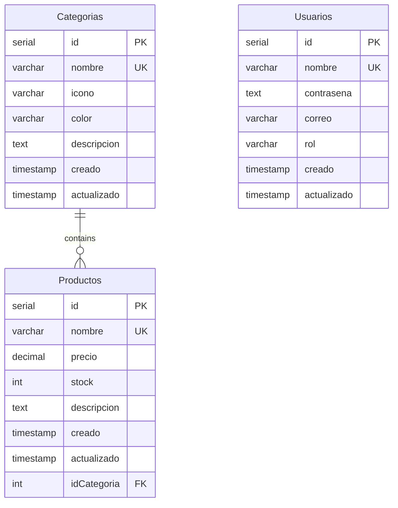
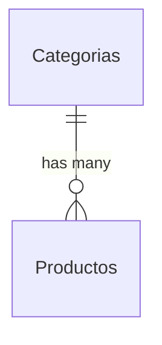

## Overview

Sistema de Productos uses PostgreSQL as its relational database. The schema consists of three main tables (Productos, Categorias, Usuarios) with corresponding views for formatted data presentation.

## Database Structure



## Tables

### Categorias Table

Stores product categories with visual attributes (icon and color) for UI rendering.

```sql server/config/bd.sql
CREATE TABLE Categorias (
  id SERIAL PRIMARY KEY,
  nombre VARCHAR(50) NOT NULL UNIQUE,
  icono VARCHAR(50) NOT NULL,
  color VARCHAR(50) NOT NULL,
  descripcion TEXT,
  creado TIMESTAMP NOT NULL,
  actualizado TIMESTAMP
);
```

#### Column Details

<Accordion title="id (Primary Key)">
  - **Type**: SERIAL (auto-incrementing integer)
  - **Description**: Unique identifier for each category
  - **Auto-generated**: Yes
</Accordion>

<Accordion title="nombre (Unique)">
  - **Type**: VARCHAR(50)
  - **Constraints**: NOT NULL, UNIQUE
  - **Description**: Category name (e.g., "Computadores", "Celulares")
  - **Validation**: Must be unique across all categories
</Accordion>

<Accordion title="icono">
  - **Type**: VARCHAR(50)
  - **Constraints**: NOT NULL
  - **Description**: Icon identifier for UI display (e.g., "Computador", "Celular")
  - **Usage**: Referenced by frontend components for icon rendering
</Accordion>

<Accordion title="color">
  - **Type**: VARCHAR(50)
  - **Constraints**: NOT NULL
  - **Description**: Color name for category badges (e.g., "Índigo", "Azul Cielo")
  - **Usage**: Used for visual categorization in the UI
</Accordion>

<Accordion title="descripcion">
  - **Type**: TEXT
  - **Constraints**: NULL allowed
  - **Description**: Detailed description of the category
</Accordion>

<Accordion title="creado / actualizado">
  - **Type**: TIMESTAMP
  - **Description**: Creation and last update timestamps
  - **creado**: Required (NOT NULL)
  - **actualizado**: Optional (NULL allowed)
</Accordion>

#### Sample Data

```sql
INSERT INTO Categorias (nombre, icono, color, descripcion, creado) VALUES
('Computadores', 'Computador', 'Índigo', 'Computadoras de diversas marcas y especificaciones.', CURRENT_DATE),
('Celulares', 'Celular', 'Azul Cielo', 'Teléfonos inteligentes con las últimas tecnologías.', CURRENT_DATE),
('Accesorios', 'Paleta', 'Verde', 'Complementos y periféricos para tus dispositivos.', CURRENT_DATE),
('Periféricos', 'Mouse', 'Morado', 'Dispositivos externos como teclados, ratones y monitores.', CURRENT_DATE);
```

### Productos Table

Stores product information with pricing, inventory, and category relationship.

```sql server/config/bd.sql
CREATE TABLE Productos (
  id SERIAL PRIMARY KEY,
  nombre VARCHAR(100) NOT NULL UNIQUE,
  precio DECIMAL(10, 2) NOT NULL,
  stock INT NOT NULL DEFAULT(0),
  descripcion TEXT,
  creado TIMESTAMP NOT NULL,
  actualizado TIMESTAMP,
  idCategoria INT REFERENCES Categorias(id) NOT NULL
);
```

#### Column Details

<Accordion title="id (Primary Key)">
  - **Type**: SERIAL
  - **Description**: Unique identifier for each product
  - **Auto-generated**: Yes
</Accordion>

<Accordion title="nombre (Unique)">
  - **Type**: VARCHAR(100)
  - **Constraints**: NOT NULL, UNIQUE
  - **Description**: Product name
  - **Validation**: Must be unique - no duplicate product names allowed
</Accordion>

<Accordion title="precio">
  - **Type**: DECIMAL(10, 2)
  - **Constraints**: NOT NULL
  - **Description**: Product price with up to 10 digits total and 2 decimal places
  - **Example**: 999.99, 1299.99
  - **Max value**: 99,999,999.99
</Accordion>

<Accordion title="stock">
  - **Type**: INT
  - **Constraints**: NOT NULL
  - **Default**: 0
  - **Description**: Current inventory quantity
  - **Usage**: Tracked for inventory management
</Accordion>

<Accordion title="descripcion">
  - **Type**: TEXT
  - **Constraints**: NULL allowed
  - **Description**: Detailed product description
</Accordion>

<Accordion title="idCategoria (Foreign Key)">
  - **Type**: INT
  - **Constraints**: NOT NULL, REFERENCES Categorias(id)
  - **Description**: Links product to its category
  - **Relationship**: Many products to one category
  - **Referential Integrity**: Enforced by PostgreSQL
</Accordion>

#### Sample Data

```sql
INSERT INTO Productos (nombre, idCategoria, precio, stock, descripcion, creado) VALUES
('iPhone 14 Pro', 2, 999.99, 50, 'Teléfono inteligente de alta gama con pantalla OLED y cámara triple.', CURRENT_DATE),
('MacBook Air M2', 1, 1299.99, 30, 'Laptop ultraligera con chip Apple M2 y pantalla Retina.', CURRENT_DATE),
('Mouse Logitech MX Master', 4, 79.99, 60, 'Mouse inalámbrico ergonómico con múltiples botones.', CURRENT_DATE);
```

<Note>
  The foreign key constraint ensures that every product must belong to an existing category. Attempting to delete a category with associated products will fail unless cascading deletes are configured.
</Note>

### Usuarios Table

Stores user accounts with authentication credentials and role-based access control.

```sql server/config/bd.sql
CREATE TABLE Usuarios (
  id SERIAL PRIMARY KEY,
  nombre VARCHAR(20) NOT NULL UNIQUE,
  contrasena TEXT NOT NULL,
  correo VARCHAR(50) NOT NULL,
  rol VARCHAR(20) NOT NULL,
  creado TIMESTAMP NOT NULL,
  actualizado TIMESTAMP
);
```

#### Column Details

<Accordion title="id (Primary Key)">
  - **Type**: SERIAL
  - **Description**: Unique identifier for each user
  - **Usage**: Referenced in JWT tokens for authentication
</Accordion>

<Accordion title="nombre (Unique)">
  - **Type**: VARCHAR(20)
  - **Constraints**: NOT NULL, UNIQUE
  - **Description**: Username for login
  - **Max Length**: 20 characters
  - **Validation**: Must be unique - no duplicate usernames
</Accordion>

<Accordion title="contrasena">
  - **Type**: TEXT
  - **Constraints**: NOT NULL
  - **Description**: Hashed password (bcrypt or pgcrypto)
  - **Storage**: Never store plain-text passwords
  - **Hashing**: bcrypt with 10 salt rounds (application layer) or pgcrypto (database layer)
</Accordion>

<Accordion title="correo">
  - **Type**: VARCHAR(50)
  - **Constraints**: NOT NULL
  - **Description**: User email address
  - **Usage**: Used for password recovery and notifications
</Accordion>

<Accordion title="rol">
  - **Type**: VARCHAR(20)
  - **Constraints**: NOT NULL
  - **Description**: User role for access control
  - **Values**: "Administrador" or other role names
  - **Usage**: Checked by authorization middleware
</Accordion>

#### Sample Data

```sql
-- Enable pgcrypto extension for password hashing
CREATE EXTENSION IF NOT EXISTS pgcrypto;

-- Create admin user with encrypted password
INSERT INTO Usuarios (nombre, contrasena, correo, rol, creado, actualizado)
VALUES (
  'admin01',
  crypt('Admin01*', gen_salt('bf')),  -- Blowfish encryption
  'admin@email.com',
  'Administrador',
  CURRENT_TIMESTAMP,
  NULL
);
```

<Warning>
  The `contrasena` field stores hashed passwords. Never query or display this field in application logs or user interfaces.
</Warning>

## Views

Views provide formatted data with joined relationships and human-readable timestamps.

### ProductosView

Combines product data with category information and formats timestamps.

```sql server/config/bd.sql
CREATE VIEW ProductosView AS
SELECT 
  P.id,
  P.nombre,
  P.precio,
  P.stock,
  P.descripcion,
  C.id AS categoria_id,
  C.nombre AS categoria,
  C.icono,
  C.color,
  TO_CHAR(P.creado, 'DD/MM/YYYY') AS creado_fecha,
  TO_CHAR(P.creado, 'HH24:MI:SS') AS creado_hora,
  TO_CHAR(P.actualizado, 'DD/MM/YYYY') AS actualizado_fecha,
  TO_CHAR(P.actualizado, 'HH24:MI:SS') AS actualizado_hora
FROM Productos P, Categorias C
WHERE C.id = P.idCategoria;
```

#### View Benefits

<CardGroup cols={2}>
  <Card title="Joined Data" icon="link">
    Automatically includes category name, icon, and color with each product.
  </Card>
  
  <Card title="Formatted Dates" icon="calendar">
    Timestamps split into separate date (DD/MM/YYYY) and time (HH24:MI:SS) fields.
  </Card>
  
  <Card title="Simplified Queries" icon="code">
    Models can query the view instead of writing complex JOINs.
  </Card>
  
  <Card title="Consistent Formatting" icon="table">
    Ensures consistent date/time formatting across the application.
  </Card>
</CardGroup>

#### Usage in Models

From `server/models/productos.model.js`:

```javascript
class Productos {
  async listar() {
    const sql = 'SELECT * FROM ProductosView ORDER BY nombre;';
    const resultado = await pool.query(sql);
    return resultado.rows;
  }

  async leer(id) {
    const sql = 'SELECT * FROM ProductosView WHERE id = $1;';
    const resultado = await pool.query(sql, [ id ]);
    return resultado.rows[0];
  }
}
```

<Info>
  The view is read-only for SELECT queries. INSERT, UPDATE, and DELETE operations must target the base `Productos` table.
</Info>

### CategoriasView

Formats category timestamps for display.

```sql server/config/bd.sql
CREATE VIEW CategoriasView AS
SELECT 
  id,
  nombre,
  descripcion,
  icono,
  color,
  TO_CHAR(creado, 'DD/MM/YYYY') AS creado_fecha,
  TO_CHAR(creado, 'HH24:MI:SS') AS creado_hora,
  TO_CHAR(actualizado, 'DD/MM/YYYY') AS actualizado_fecha,
  TO_CHAR(actualizado, 'HH24:MI:SS') AS actualizado_hora
FROM Categorias;
```

#### View Fields

- **creado_fecha**: Creation date in DD/MM/YYYY format
- **creado_hora**: Creation time in 24-hour format (HH24:MI:SS)
- **actualizado_fecha**: Last update date (NULL if never updated)
- **actualizado_hora**: Last update time (NULL if never updated)

### UsuariosView

Provides user data WITHOUT the password hash for safe querying.

```sql server/config/bd.sql
CREATE VIEW UsuariosView AS
SELECT 
  id,
  nombre,
  correo,
  rol,
  TO_CHAR(creado, 'DD/MM/YYYY') AS creado_fecha,
  TO_CHAR(creado, 'HH24:MI:SS') AS creado_hora,
  TO_CHAR(actualizado, 'DD/MM/YYYY') AS actualizado_fecha,
  TO_CHAR(actualizado, 'HH24:MI:SS') AS actualizado_hora
FROM Usuarios;
```

<Warning>
  Notice that `contrasena` is explicitly excluded from this view. Always use `UsuariosView` for listing users to prevent accidental password hash exposure.
</Warning>

## Relationships

### One-to-Many: Categorias → Productos



- **Type**: One-to-Many
- **Description**: Each category can have multiple products, but each product belongs to exactly one category
- **Foreign Key**: `Productos.idCategoria` references `Categorias.id`
- **Constraint**: `REFERENCES Categorias(id) NOT NULL`

#### Relationship Rules

<Steps>
  <Step title="Referential Integrity">
    PostgreSQL enforces that `idCategoria` must reference an existing category.
  </Step>
  
  <Step title="Required Relationship">
    Every product MUST have a category (NOT NULL constraint).
  </Step>
  
  <Step title="Deletion Protection">
    Cannot delete a category if products reference it (unless CASCADE is configured).
  </Step>
</Steps>

## Data Types

### Common Types Used

<Accordion title="SERIAL">
  - **Description**: Auto-incrementing integer
  - **Usage**: Primary keys (id columns)
  - **Range**: 1 to 2,147,483,647
  - **Behavior**: Automatically increments on each INSERT
</Accordion>

<Accordion title="VARCHAR(n)">
  - **Description**: Variable-length string with maximum length
  - **Usage**: Names, emails, short text fields
  - **Example**: VARCHAR(50) allows up to 50 characters
  - **Storage**: Only uses space for actual content + 1-2 bytes overhead
</Accordion>

<Accordion title="TEXT">
  - **Description**: Variable-length string with no specific length limit
  - **Usage**: Descriptions, passwords (hashed), long content
  - **Limit**: Up to 1GB per value
  - **Performance**: Slightly slower than VARCHAR for very short strings
</Accordion>

<Accordion title="DECIMAL(10, 2)">
  - **Description**: Fixed-point decimal number
  - **Usage**: Prices, monetary values
  - **Format**: DECIMAL(precision, scale)
  - **Example**: 999.99 (10 total digits, 2 after decimal)
  - **Advantage**: Exact arithmetic (no floating-point errors)
</Accordion>

<Accordion title="INT / INTEGER">
  - **Description**: 4-byte integer
  - **Range**: -2,147,483,648 to 2,147,483,647
  - **Usage**: Stock quantities, counts, foreign keys
</Accordion>

<Accordion title="TIMESTAMP">
  - **Description**: Date and time (no timezone)
  - **Format**: YYYY-MM-DD HH:MI:SS
  - **Usage**: Created/updated timestamps
  - **Functions**: CURRENT_TIMESTAMP, CURRENT_DATE
</Accordion>

## Constraints

### Primary Keys

All tables use SERIAL primary keys:

```sql
id SERIAL PRIMARY KEY
```

- Ensures unique identification for each record
- Auto-increments on INSERT
- Indexed automatically for fast lookups

### Unique Constraints

Prevent duplicate values in specific columns:

```sql
nombre VARCHAR(50) NOT NULL UNIQUE
```

Applied to:
- `Categorias.nombre` - Unique category names
- `Productos.nombre` - Unique product names  
- `Usuarios.nombre` - Unique usernames

### Foreign Key Constraints

Enforce referential integrity:

```sql
idCategoria INT REFERENCES Categorias(id) NOT NULL
```

- Ensures `idCategoria` exists in `Categorias` table
- Prevents orphaned records
- Blocks deletion of referenced categories

### NOT NULL Constraints

Require values for critical fields:

- All `id`, `nombre`, `creado` fields are NOT NULL
- Prices, stock, and category relationships are required
- `actualizado` timestamps allow NULL (not yet updated)

### Default Values

```sql
stock INT NOT NULL DEFAULT(0)
```

- `Productos.stock` defaults to 0 if not specified
- Ensures stock is never undefined

## Common Queries

### Get All Products with Category Info

```sql
SELECT * FROM ProductosView ORDER BY nombre;
```

### Get Products by Category

```sql
SELECT * FROM ProductosView WHERE categoria_id = 1;
```

### Get Low Stock Products

```sql
SELECT nombre, stock, precio, categoria 
FROM ProductosView 
WHERE stock < 20 
ORDER BY stock ASC;
```

### Count Products per Category

```sql
SELECT 
  C.nombre AS categoria,
  COUNT(P.id) AS total_productos
FROM Categorias C
LEFT JOIN Productos P ON C.id = P.idCategoria
GROUP BY C.nombre
ORDER BY total_productos DESC;
```

### Find Users by Role

```sql
SELECT * FROM UsuariosView WHERE rol = 'Administrador';
```

### Get Recently Added Products

```sql
SELECT nombre, precio, categoria, creado_fecha, creado_hora
FROM ProductosView
ORDER BY creado DESC
LIMIT 10;
```

## Database Initialization

To set up the database, execute the SQL file:

```bash
# Create database
createdb ejercicio_productos

# Run initialization script
psql -d ejercicio_productos -f server/config/bd.sql
```

The `bd.sql` file contains:
1. Table creation statements
2. pgcrypto extension installation
3. View creation
4. Sample data insertion (categories, products, admin user)

<Note>
  The script includes sample data for testing. Review and modify the INSERT statements before running in production.
</Note>

## Connection Configuration

Database connection is configured via environment variables:

```javascript server/config/database.js
import { Pool } from 'pg';
import 'dotenv/config';

const pool = new Pool({
  user: process.env.PG_USER || 'postgres',
  host: process.env.PG_HOST || 'localhost',
  database: process.env.PG_DATABASE || 'ejercicio_productos',
  password: process.env.PG_PASSWORD || 'tu_contraseña',
  port: process.env.PG_PORT || 5432,
});

pool.connect((error) => {
  if(error) throw error;
  console.log('Base de datos conectada.');
});

export default pool;
```

### Environment Variables

```bash .env
PG_USER=postgres
PG_HOST=localhost
PG_DATABASE=ejercicio_productos
PG_PASSWORD=your_secure_password
PG_PORT=5432
```

## Best Practices

<CardGroup cols={2}>
  <Card title="Use Views for Queries" icon="eye">
    Query views (ProductosView, etc.) instead of base tables for formatted data.
  </Card>
  
  <Card title="Modify Base Tables" icon="table">
    INSERT, UPDATE, DELETE operations must target base tables, not views.
  </Card>
  
  <Card title="Parameterized Queries" icon="shield">
    Always use parameterized queries ($1, $2) to prevent SQL injection.
  </Card>
  
  <Card title="Index Foreign Keys" icon="bolt">
    PostgreSQL automatically indexes PKs but consider indexing FKs for performance.
  </Card>
  
  <Card title="Hash Passwords" icon="lock">
    Never store plain-text passwords. Use bcrypt or pgcrypto.
  </Card>
  
  <Card title="Timestamp Updates" icon="clock">
    Set `actualizado = CURRENT_TIMESTAMP` in UPDATE queries.
  </Card>
</CardGroup>

## Next Steps

<CardGroup cols={2}>
  <Card title="Architecture" icon="sitemap" href="/concepts/architecture">
    Learn how the database integrates with the application architecture
  </Card>
  <Card title="Authentication" icon="lock" href="/concepts/authentication">
    Understand how user credentials and roles are managed
  </Card>
</CardGroup>